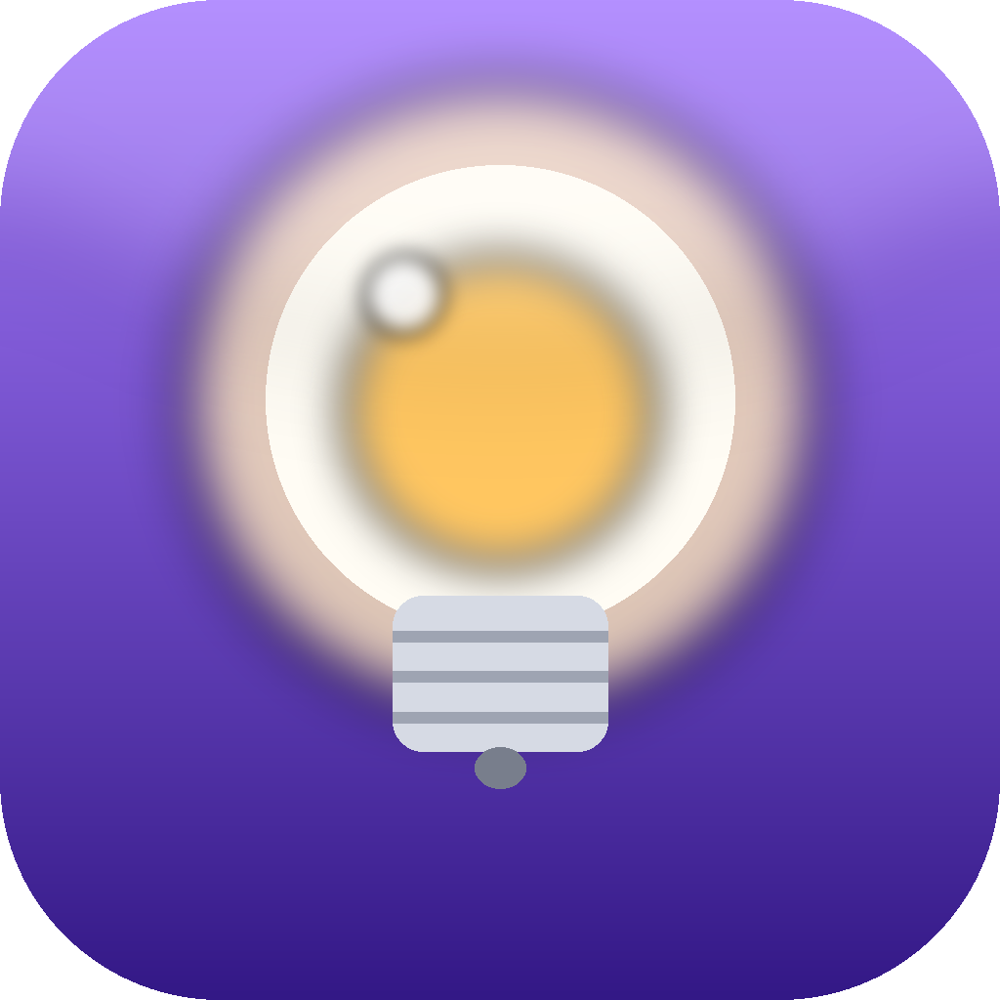
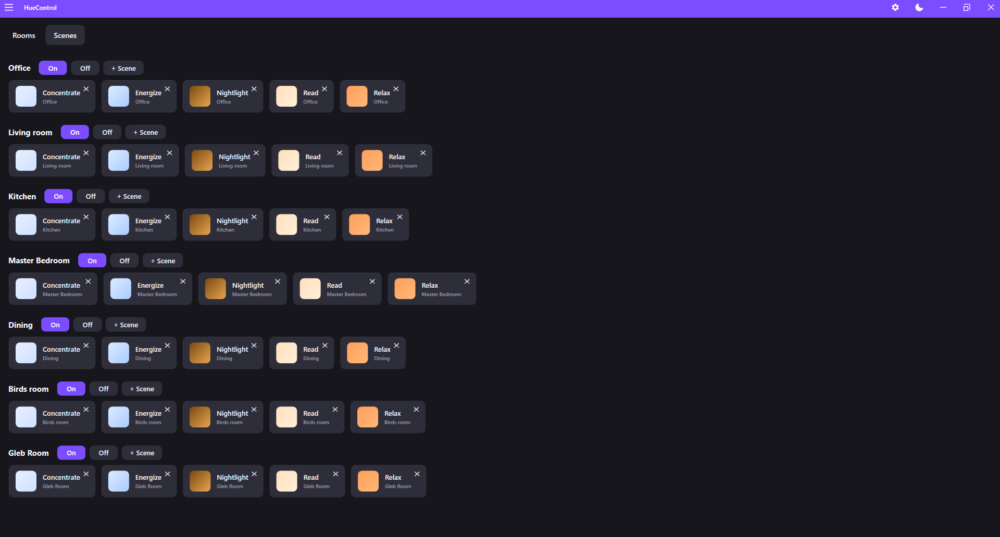
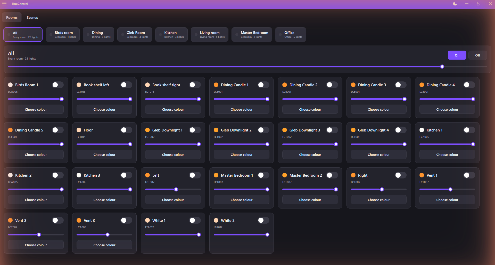
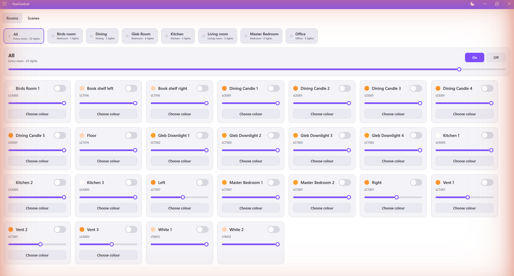
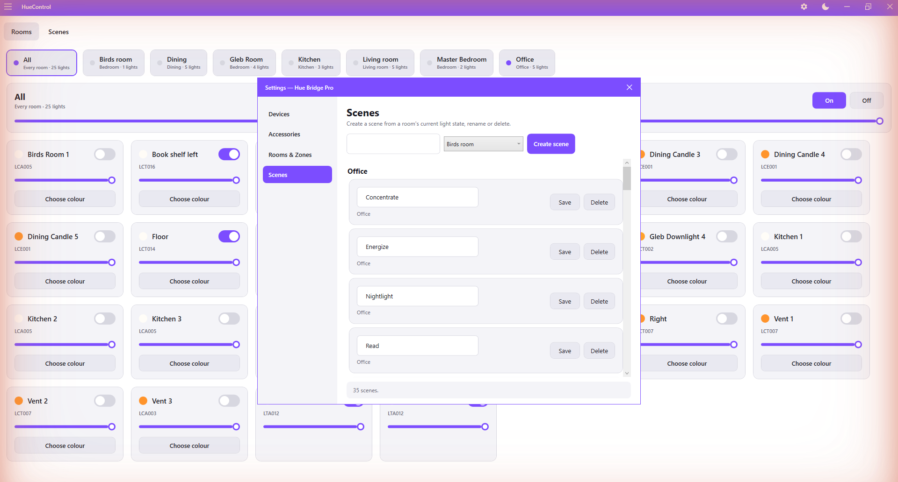
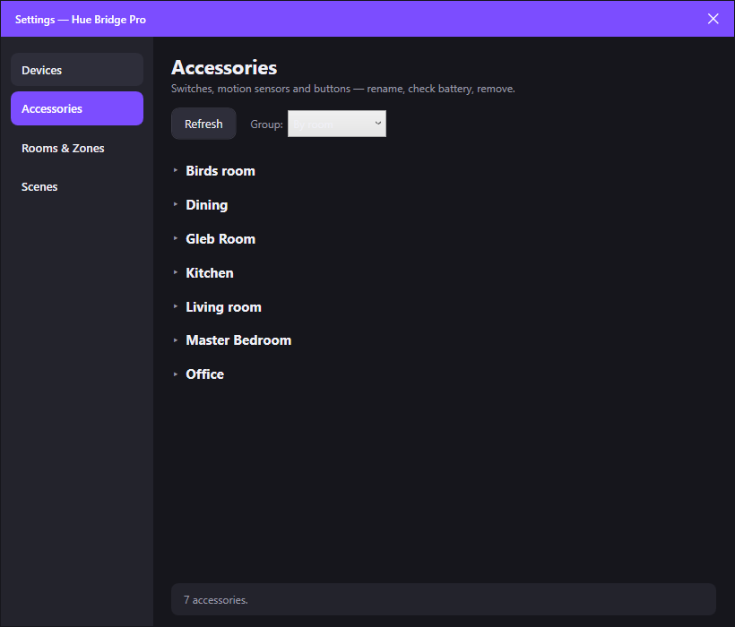
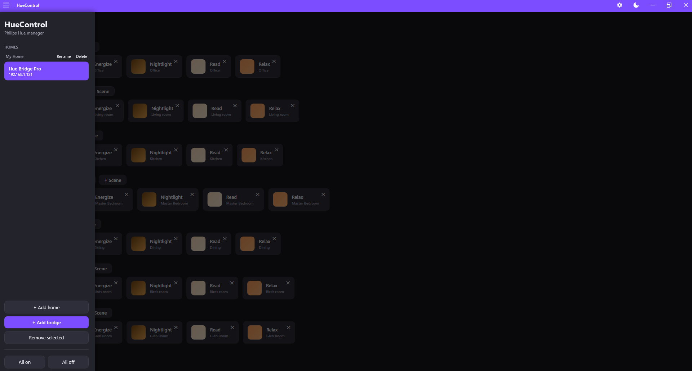

# HueControl

The Windows control centre for your **Philips Hue** lights — the desktop app Hue never
made. A fast WPF app (MVVM, light & dark themes) that controls **and manages** your Hue
setup over the local bridge REST API (v1). Works entirely on your LAN — no Hue cloud
account required after pairing.

Free and open source (GPL-3.0). Coming to the Microsoft Store.

## Screenshots



|  |  |
| --- | --- |
|  |  |
| *Rooms & lights — dark theme* | *Rooms & lights — light theme* |
|  |  |
| *Add & manage any device* | *Accessories — battery & switch setup* |
|  |  |
| *Multiple bridges grouped into homes* |  |

## Features

- **Control** lights, rooms and scenes with synced brightness and a colour picker
- **Add or remove any Hue device** — lights, plugs, motion sensors, dimmer switches,
  buttons — with search; rename and group by room and type
- **Program dimmer switches** to control a room; see accessory battery and last activity
- **Create, rename and delete** rooms, zones and scenes
- **Built-in Hue scenes** (Relax, Concentrate, Energize, Savanna sunset and more) with
  colour previews; add and delete scenes in place
- **Multiple bridges** organised into **homes**, with instant switching
- **Light and dark themes**, borderless custom window
- Works entirely on your **local network** — fast, private, offline-friendly

## Requirements

- Windows 10 / 11
- .NET 9 SDK to build (or the .NET 9 Desktop Runtime to run a published build)

## Build & run

```powershell
git clone https://github.com/aegisaosoft/huecontrol.git
cd huecontrol
dotnet run --project HueControl
```

Or run the compiled binary:

```
HueControl\bin\Release\net9.0-windows\HueControl.exe
```

Run the tests:

```powershell
dotnet test
```

## First use

1. Click **+ Add bridge**.
2. Click **Discover on network** (or type the bridge IP, e.g. `192.168.1.x`).
3. **Press the round link button on the bridge**, then click **Pair**.
4. The bridge appears in the sidebar; its lights, rooms and scenes load automatically.

Add as many bridges as you like and group them into homes from the sidebar. Bridge
connection details are stored only on your device (`%AppData%\HueControl\homes.json`).

## Project layout

```
HueControl/
  Models/        DTOs for the Hue datastore + saved-bridge/home models
  Services/      HueApiClient, discovery, settings store, colour math,
                 ThemeManager, SwitchProgrammer, HueScenePresets, thumbnails
  Mvvm/          ObservableObject, RelayCommand / AsyncRelayCommand, Grouping
  ViewModels/    Main, Light, Group, Scene, Home, Settings + Devices /
                 Accessories / Rooms / Scenes sections
  Themes/        Dark.xaml, Light.xaml (swappable palettes)
  Views          MainWindow, SettingsWindow, AddBridgeWindow,
                 InputDialog, ScenePickerDialog, App (styles)
HueControl.Tests/  xUnit tests (stubbed HTTP + optional live-bridge tests)
StoreAssets/       Microsoft Store images, manifest, listing, screenshots
```

## License

Licensed under the **GNU General Public License v3.0** — see [LICENSE](LICENSE).
You are free to use, study, share and modify HueControl; derivative works must also be
released under the GPL-3.0.

## Privacy

HueControl collects no personal data and sends nothing to any server. It talks only to
your Hue bridges on your own network. Full policy:
**https://aegisaosoft.github.io/huecontrol/**

## Disclaimer

HueControl is an independent application and is not affiliated with, endorsed by, or
sponsored by Signify N.V. or Philips. "Philips Hue" is a trademark of Signify Holding.

---

© 2026 **Aegis AO Soft LLC** and Alexander Orlov. Released under the GPL-3.0.
